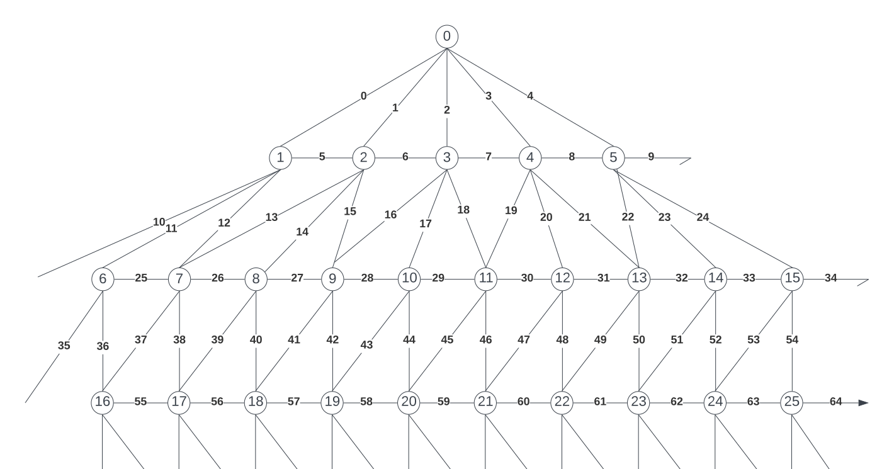

clone it to your local machine
make sure you have nodejs installed.  If not, get it from [nodejs.org](https://nodejs.org).  It comes with NPM bundled.

open command prompt and run:

`npm i -g @angular/cli`

to install the [Angular](https://angular.io) CLI.

then navigate to the folder that contains this repo.

run `ng server --open` to start it up.

Reference the segment and node numbers in the diagram below.

###### hail orb.